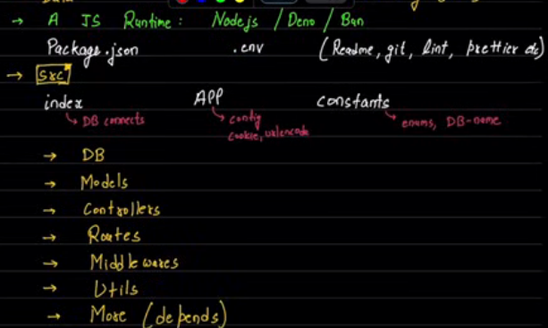

# Roadmap
JS can be used as backend language thanks to JS runtimes like Bun, Node, Deno

## Kinds of Data about User
1. Direct
    1. input fields
    2. file supplied
2. Indirect
    1. from 3rd Party(aka API)

## Folder Structure

# Deploying Backend

## Node Project (npm init optional: -y) [Reference](https://phoenixnap.com/kb/package-json)
- init utility creates package.json
    - contains metadeta about the project
    - types of metadeta:
        1. descriptive: identifiers & distinguish project
            - name: lowercase, unique(published only), avoid spaces as URL, CLI compatible
            - version: <major_fix>.<minor_fix>.<patch>
            - main: exports in this file path wrt list are returned to node when someone imports the package using require
            - license: restrictiona about use & distribution of package
            - description, keywords(indexing purposes), author/contributors, repository (loc to source code)
            - type: module makes sure that imports follow ESmodule assembly
        2. functional: install & manage project with dependencies
        - scripts contain commands that run along the lifetime of project
            - npm run <script_name> to run script commands
        - dependencies lists all used packages with their versions for core functionalities, devDependencies are libraries that are needed during development (figure out while working)
            - utilizes the libraries found in the closest parent directory
        - engines: node.js version, runtime environments
        - os, cpu
- commands: npm init, npm install, npm update, npm run <script_name>, npm uninstall <package>

# Additional
- A factory function can be defined as a function that creates an object and returns it, like constructors
- Modules: [Reference](https://blog.logrocket.com/commonjs-vs-es-modules-node-js/)
    - Browsers use ES module (use import, export)
        - dominant force in years to come
    - Node.js uses CommonJS modules (use require, exports)
    - import express from "express" preferred as we can get imports async
    