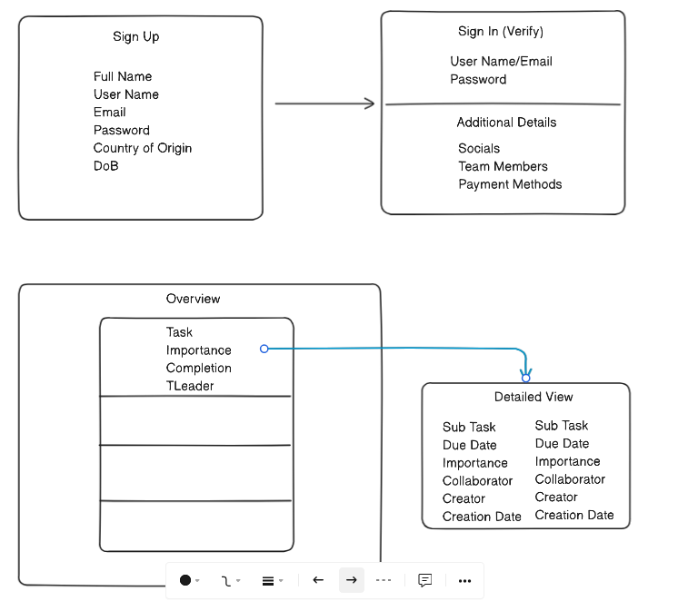

# Backend Workflow

1. determine the data that will be stored
    - worry about database later
    - utilize tools like MoonModeler, Eraser to generate **entity relationship diagrams**
        - prepared by backend engineer/database specialist
    - 
    - major task of the workflow

2. create models for the main *characters* to be stored in our DB
    - eg. user, task, subtask
    - consistent filenaming: user.models.js
        - still a js file
    - define single schema/model per file
    ```
    import mongoose from "mongoose"
    const schema = new mongoose.Schema({
        task: {
            type: String,
            unique: true,
            lowercase: false,
            default: New Task,
            required: [true,"must enter"]
        },
        creator: {
            type: mongoose.Schema.Type**s**.ObjectId,
            ref: "User"
        },
        subtasks: [{
            type: mongoose.Schema.Types.ObjectId,
            ref: "SubTask"
        }]
    }, {timestamps: true})

    const Todo = mongoose.model("Todo", schema)
    export Todo
    /* 
    visible in DB: "Todo".lower+"s"
    use supplied model name **only** like "User"
    */
    ```
    - input validation: can be done here like length, required or utilize zod library
    - {timestamp**s**: true}: gives access to createdAt, UpdatedAt commonly required
    - keep name of models in sentence case
    - it may be needed to cread subschemas that make up a greater schema, simple object alternative
        - type: [subschema]
    - when we wish to restrict user to few options, we can use enums 

3. 